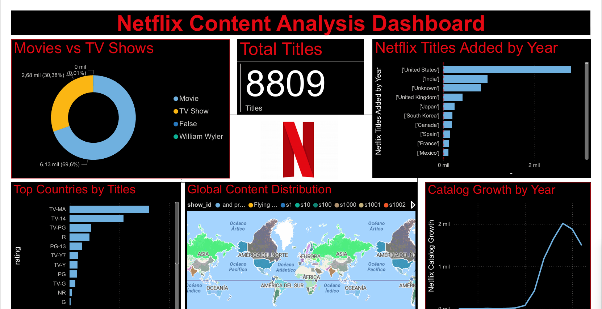

# Netflix Content Analysis Dashboard

This project explores the Netflix catalog using Python for data cleaning and exploratory data analysis (EDA), and Power BI for interactive dashboard visualization.

The goal is to understand patterns in Netflix content such as catalog growth, distribution by country, content ratings, and the balance between movies and TV shows.

---

## Dashboard Preview

---

## Key Insights

- Movies represent the majority of the Netflix catalog.
- The Netflix catalog experienced rapid growth after 2015.
- The United States is the largest contributor of titles on the platform.
- Most of the content is classified as **TV-MA**, indicating a strong focus on mature audiences.

---

## Tools & Technologies

- **Python**
- **Pandas**
- **Matplotlib**
- **Jupyter Notebook**
- **Power BI**

---

## Project Workflow

### 1. Data Cleaning
- Handling missing values
- Standardizing country information
- Splitting multi-country records
- Creating derived time features

### 2. Exploratory Data Analysis (EDA)
- Distribution of titles by year
- Movies vs TV Shows comparison
- Content rating distribution
- Country contribution analysis

### 3. Data Visualization
An interactive dashboard was built in **Power BI** including:

- Total number of titles
- Movies vs TV Shows distribution
- Catalog growth over time
- Top countries contributing content
- Content rating distribution
- Global content distribution map

---

## Dataset

Source: **Kaggle – Netflix Movies and TV Shows**

Period covered:

